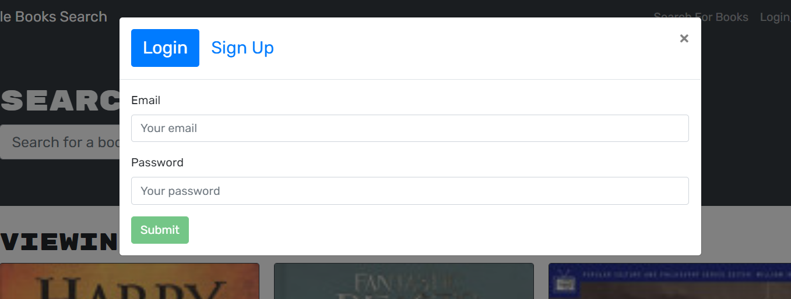

# bookSE
## Description
The purpose of this project was to refactor a RESTful API applicaton to a GraphQL APi built with Apollo Server. The application allows new and old users to save and books to/from their profile. The user has the ability to search before logging in or signing up, but that is the only functionallity. Once logged in they can create their book list. During the refactoring of this API, I ran into many difficulties, mainly typos and confusion between singular and plural variables/keys. Other than that, the project seemed straight forward using the in class activities and mini-project as reference. I am still getting used to the GraphQL syntax, but it isn't too difficult. 

## Table of Contents 
- [Installation](#installation)
- [Usage](#usage)
- [Credits](#credits)
- [License](#license)
- [Features](#features)

## Installation
The deployed is straight forward for typical signin search. To start the app via the console, clone it and run npm install for the dependancies. Then run npm run build and finally, npm run develop to launch the application locally.

## Usage
Here are the links to the deployed application via heroku [deployed app link](https://vast-wave-67030.herokuapp.com/)  or the repo [GitHub Repo](https://github.com/MaxStump13/bookSE)

When the application is loaded, the loading screen looks like the image below. 

The user can search before logging in or signing up. This is the screen they will receive from a search. 

The user cannot save any of the books until they are signed in though. If they click on the login/sign up button they are presented with these two options.

Once the user is signed in they are sent back to the home page, but the login/sing up button now says, see your books, which is a profile.

Once the user is signed in and searches, each search result will now have a button at the bottom to add to their books.

The profile displays all the books that user added to their profile. It also gives them the option to delete books. Here is the profile page and the 
profile page after one has been removed. 

## Credits

1. [MDN](https://developer.mozilla.org/en-US/)
2. [W3](https://www.w3schools.com/)
3. [Graphql](https://www.apollographql.com/docs/)
4. [Bitsrc](https://blog.bitsrc.io/migrating-existing-rest-apis-to-graphql-2c5de3db647d)
5. [heroku](https://elements.heroku.com/buttons/tracye1083/note-taker)
6. [Stackoverflow](https://www.stackoverflow.com/)
7. [Coding bootcamp](https://coding-boot-camp.github.io/full-stack/mongodb/deploy-with-heroku-and-mongodb-atlas)

## License

## Features
1. Homepage with search available before login
2. Login/signup drop down modal
3. 2 hr session via token
4. save/remove books from unique profile

## How to Contribute
If there are any suggestions to improve this generator, this is my [GitHub](https://github.com/MaxStump13) account. 
